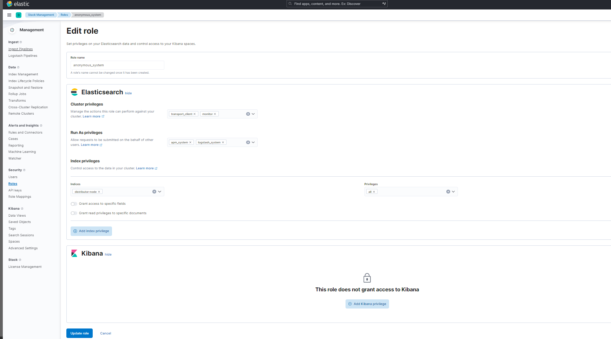
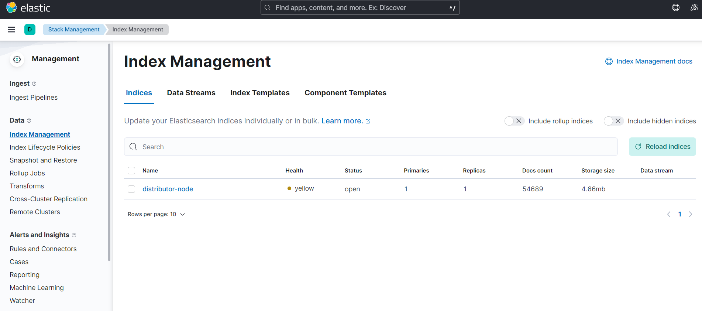
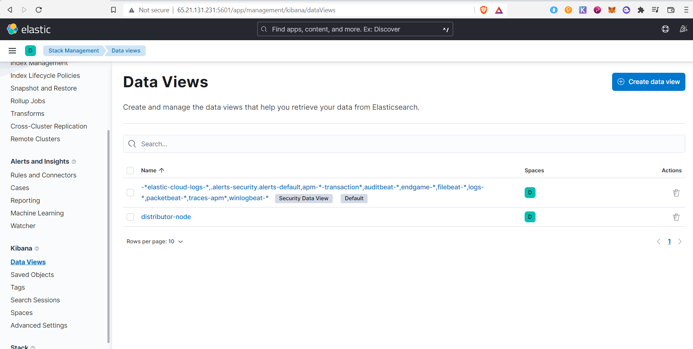
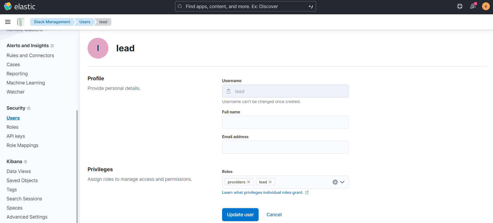

# ELK (Elasticsearch + Kibana) 8.2.2 with Docker


## Setup hosting
[Go here for the installation guide](./hosting/README.md)


## Setup
```
git clone https://github.com/yasiryagi/elasticsearch-docker.git
cd elasticsearch-docker

#set up data folders
mkdir ./kibana/data
chown -R 1000:1000 ./kibana/data
chmod -R 777 ./kibana/data

mkdir ./elasticsearch/data/
chown -R 1000:1000 ./elasticsearch/data/
chmod -R 777 ./elasticsearch/data/

#Change the password
nano kibana/config/kibana.yml
docker-compose up -d
```

## Setup passwords

```
docker exec -it elasticsearch bin/elasticsearch-setup-passwords interactive
```

## Access 
 
> Elasticsearch: https://<elasticsearch.your.cool.url>

> Kibana: https://<kibana.your.cool.url>

> User `elastic` and password `YourPassword` 

> Note system sending data will use the anonymous user. 

## Setup  anonymous_system Role

Login into Kibana > Stack Management > Security > Roles > Create role



## Create a data view 

Under Kibana > Stack Management > Index Managment should see either distributor-node, storage-node or both depend on you setup


Under Kibana > Stack Management > Data views > create data view 
 


## Create lead users

Kibana > Stack Management > Security > Users > Create user


